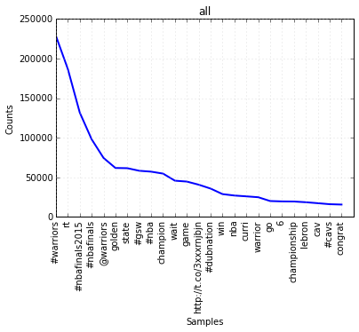

# Software elements

## Acquisition

The acquisition code is split into a few kinds of objects:

 * `acq.py`: driver program. Creates a tweet Collector in search or stream mode.  As the only user, I decided not to expose the  the  none of the configuration choices are exposed as parameters, but are changed  in this script.
 * `credentials.py`: easy access to credentials in config files
 * `collector.py`: gets data from Twitter (search or stream APIs), passes it to a Facet
 * `listeners.py`: stream listener used in Collector
 * `facets.py`: decides whether or not to process a tweet, and what Sink(s) to send it to.  Right now, there is only one, which uses regexp matching based on the tags 
* `sinks.py`: A variety of somewhat (ad hoc) composable policies for writing tweets to storage.  These should be made more nicely composable, but for that can wait till it's needed. 
  * For now, the top level sink is a `RollingSink`, which rolls files based on the caller-provided record limit and path format string.
  * In this app, it wraps a `RecordSink`, which turns the records written to it into a JSON array.
  * That sits on top of either a `FileSink` or an `S3Sink`.

## Processing

The processing code is in `proc.ipynb`, but the python code is extracted into `proc.py` and the output into `proc.md` and auxiliary files.
This code just reads and decodes each file in parallel, with some twitter-specific hacks on around `nltk.EnglishStemmer` to avoid breaking up URLs, hashtags and mentions.
For expediency, I downloaded the files from s3 to a subdirectory `tweets`, though for larger data sets I would likely leave them there and process using `mrjob`.

## Output

The tweets are stored in bucket `s3://nkrishna-mids205-hw2` .
The frequency plots are the `png` files associated with the notebook (see [proc.py], and reproduced here:

