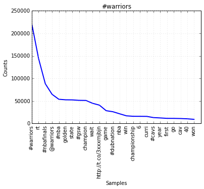

# Software elements

## Acquisition

The acquisition code is split into a few kinds of objects:

* `acq.py`: driver program.
  * Creates a tweet Collector in search or stream mode.
  * As the only user, I decided not to expose the query terms and options as parameters, but to modify them in place. This should be revisited when reused.
    * Currently, that means the tags to look for, the language, and the timeframe are in this source file.
* `credentials.py`: easy access to credentials in config files
  * twitter credentials are read from `~/.tweepy`
  * AWS credentials are read from `~/aws/credentials`.
* `collector.py`: talks to twitter
  * The Collector gets data from Twitter using either search or stream APIs
  * It controls the pathnames of the rolling log files via the sink creation callback `makeSink`.  This should move to the interface. This is currently where the S3 AWS credentials are used.
  * When streaming, it uses the `EmittingListener` in `listener.py` as its listener
  * The Collector then passes each tweet to a Facet
    * The facet is invoked as a context manager using `contextutil.closing()`, guaranteeing that the facet's `close` method will be called in case of exception.  This will cause in data in progress to be written to file(s).
    * It passes a callback for creating a sink from a key to the Facet.  This is kind of ugly, and the decisions of what S3 bucket to use and what the file path format string are should be exposed in the interface.
  * As a convenience, I added a `progress.counter` subclass that will show a progress bar if using the search API for a specific date range, and a tweet counter otherwise.
  * The last `id` and `created_at` timestamp.  In certain retry cases, if the last ID is set, it will send that to the API endpoint as a max or since ID.
* `listeners.py`: stream listener used in Collector
  * The most interesting bit here is the `pysigset.suspended_signals` context manager.
    * This wraps the code sending a tweet from `on_status` to the appropriate sink.
    * It ensures that external signals (specifically, SIGINT and SIGTERM) will only be delivered after finishing the sink write operations, when they are in a consistent state to be closed when the Facet is closed.
    * For the search API, there is analogous code in the Collector.  It should probably be moved to its own class to facilitate new collectors' being written, possibly shared with the listener.
* `facets.py`: decides whether or not to process a tweet, and what Sink(s) to send it to.
  * Right now, there is only one, `FilteringFacet`, which uses a `RegexpMatcher` to identify messages with particular tags, and for composing the file paths for the corresponding sink.
* `matchers.py`: policy class for the `FilteringFacet`.
  * This has one method, `check`, which receives a tweet.  If the tweet matches the regexp, all matches are transformed to lowercase, deduped, and joined with underscores as the delimiter to form the key it returns.  If there are no matches, it returns `None`.
* `sinks.py`: A variety of somewhat ad hoc, somewhat composable policies for writing tweets to storage.
  * These should be made more nicely composable, but for that can wait till it's needed. 
  * In this app, the top level sink is a `RollingSink`, which rolls files based on the caller-provided record limit and path format string.
  * It wraps a `RecordSink`, which prints the records written to it with an open square bracket, commas at the ends of records, and a close square bracket, so that JSON records written to it will be a well-formed array. 
  * That sits on top of either a `FileSink` or an `S3Sink`, which write to a local FS or S3, respectively.

## Processing

* The processing code is in `proc.ipynb`, but the python code is extracted into `proc.py` and the output into `proc.md` and auxiliary files.
* For expediency, I downloaded the files from s3 to a subdirectory `tweets` and processed them locally.  For larger data sets I would likely leave them there and refactor the code to process them using `mrjob`.

For each tag, I read in and JSON-decodes the files for that tag in parallel.
The tweets from each file are tokenized using my own regexp, which matches
  * http or https URLs
  * mentions and hashtags, including the octothorpe or at sign
  * sequences of alphanumeric characters plus apostrophes
The last category corresponds to actual words, so the tokens are downcased and passed to `nltk.EnglishStemmer`.  The others are just downcased (including URLs, which probably should not be).
Since the stemmer will turn punctuation into standalone tokens, single-character tokens are skipped unless alphanumeric.  If the token is in the `nltk` stopwords list, it is also skipped.
Finally, empty tokens are skipped.  At this point, the token is added to a `FreqDist` (one per file being processed).
Once all tweets in a file are processed, the FreqDist is returned,
`Parallel` presents the `FreqDist`s to the caller as a sequence. I loop over these updating `ConditionalFreqDist`' using the tag as the condition.
After processing all the tags, I use each condition/tag's `FreqDist` to make an overall `FreqDist` with condition `'all'`, and finally loop over the tags and plot each `FrequencyDistribution`.

## Output

The tweets are stored in bucket `s3://nkrishna-mids205-hw2` .

The frequency plots are the `png` files associated with the notebook (see [proc.py](proc.py), and are included below:

