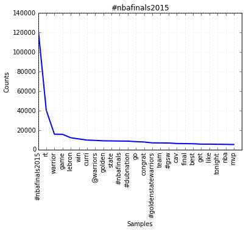
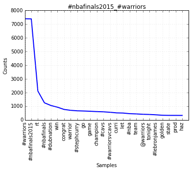

    %matplotlib inline

    import os
    import os.path
    import json
    import re
    from joblib import Parallel, delayed

    from nltk.probability import ConditionalFreqDist, FreqDist
    from nltk.stem.snowball import EnglishStemmer
    from nltk.tokenize import word_tokenize

    cfd = ConditionalFreqDist()
    s = EnglishStemmer(ignore_stopwords=True)
    
    rex = re.compile('(https?://\S+|(?:[#@])?\w[\w\']*)', re.U)

    def processFile(filename):
        fd = FreqDist()
        with open(filename) as f:
            for tweet in json.load(f):
                for word in rex.findall(tweet[u'text']):
                    if (not word.startswith('@') and
                        not word.startswith('#') and
                        not word.startswith('http')):
                        stem = s.stem(word.lower())
                        if len(stem) == 1 and not stem.isalnum():
                            stem = ''
                    else:
                        stem = word.lower()
                    if stem != '':
                        fd[stem] += 1
        return fd

    for tag in [u'#nbafinals2015', u'#nbafinals2015_#warriors', u'#warriors']:
        words = {}
        for root, path, files in os.walk(u'tweets/' + tag):
            for fd in Parallel(n_jobs=8)(delayed(processFile)(os.path.join(root, filename)) for filename in files):
                cfd[tag].update(fd)
        cfd['all'].update(cfd[tag])
            

    for tag in sorted(cfd.keys()):
        cfd[tag].plot(15, title=tag)

